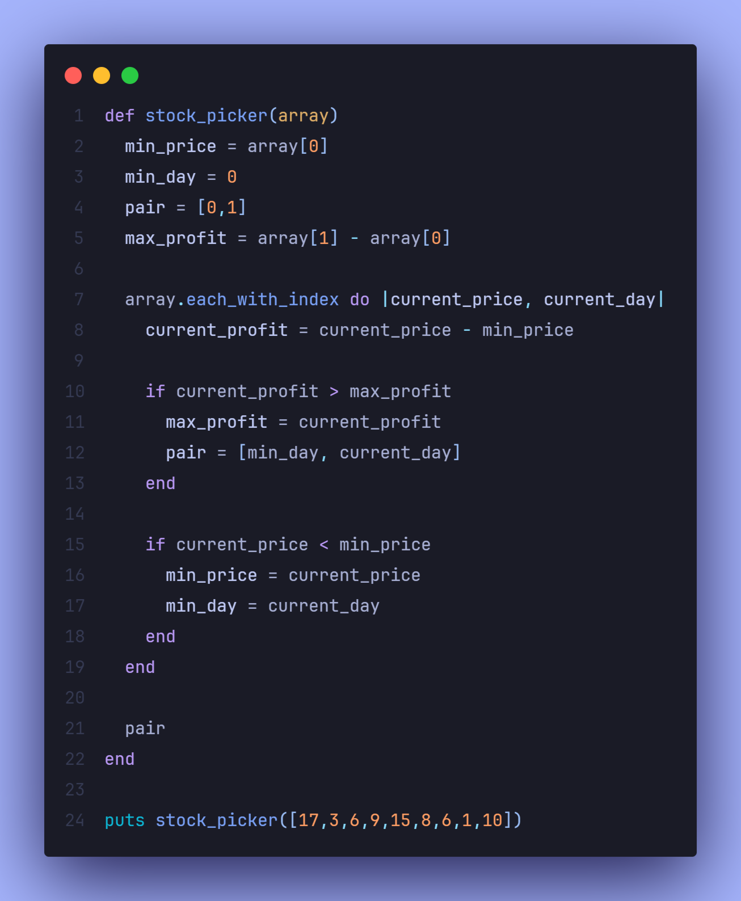

# 

 
 

The Stock Picker project is a practical Ruby exercise from The Odin Project's Ruby curriculum. It is designed to help you implement an algorithm that finds the best days to buy and sell stocks to maximize profit. This task involves iterating through an array of stock prices and identifying the most optimal days for buying and selling.

 Screenshots

  
    

    

## 📝 Project Objective

The goal of this project is to build a method called #stock_picker that takes in an array of stock prices, where each index represents a day, and outputs the pair of days that will result in the highest profit. This project reinforces your understanding of arrays, iteration, and implementing condition-based algorithms.

## 🔧 Features

- **Array Traversal**: Iterates over an array of stock prices.

- **Profit Calculation**: Compares different days to find the best day to buy and sell for maximum profit.

- **Edge Case Handling**: Ensures that the lowest price isn't the last day and that the highest price isn't the first.

## 📖 Learnings

- **Array and Indexing Operations**: Improved my ability to iterate over arrays and access specific indices for comparison.

- **Profit Calculation Algorithm**: Practiced developing an algorithm to calculate profit efficiently by comparing stock prices on different days.

- **Conditional Logic**: Enhanced my understanding of conditional statements to determine optimal buy and sell days.

- **Edge Case Handling**: Gained experience in handling edge cases, such as when the lowest price is at the end of the list or the highest price is at the start.

## 💻 Technologies Used

- **Ruby** for developing the algorithm and working with arrays and control structures.

## 💡 Acknowledgments

- **The Odin Project**: For providing the project outline and guidance.
